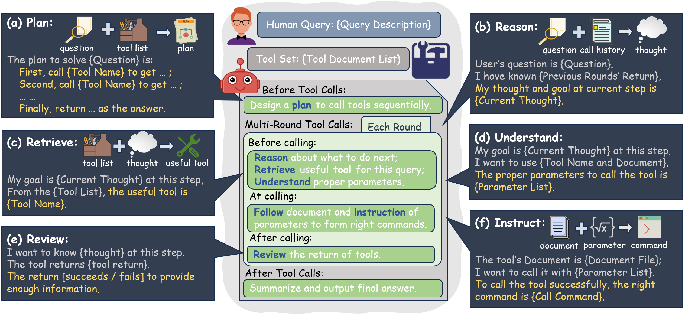
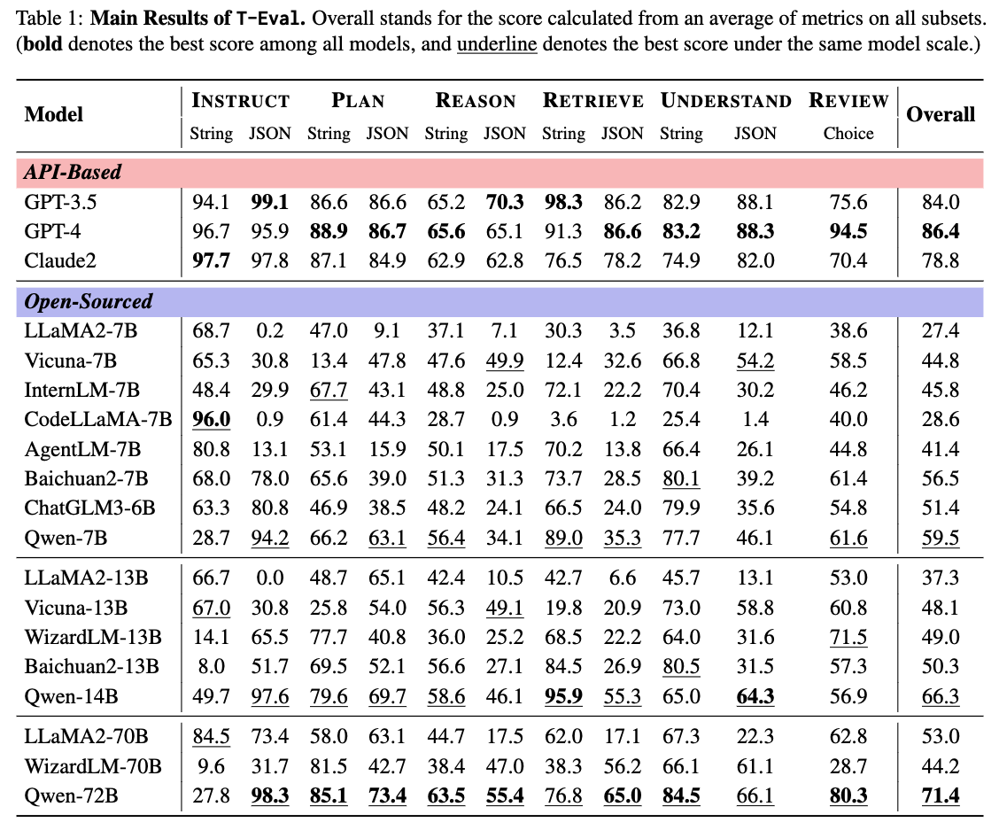

# T-Eval: Evaluating the Tool Utilization Capability Step by Step

[](https://arxiv.org/abs/2312.14033)
[](./LICENSE)

## ✨ Introduction  

This is an evaluation harness for the benchmark described in [T-Eval: Evaluating the Tool Utilization Capability Step by Step](https://arxiv.org/abs/2312.14033). 

[[Paper](https://arxiv.org/abs/2312.14033)]
[[Project Page](https://open-compass.github.io/T-Eval/)]
[[LeaderBoard](https://open-compass.github.io/T-Eval/leaderboard.html)]

> Large language models (LLM) have achieved remarkable performance on various NLP tasks and are augmented by tools for broader applications. Yet, how to evaluate and analyze the tool utilization capability of LLMs is still under-explored. In contrast to previous works that evaluate models holistically, we comprehensively decompose the tool utilization into multiple sub-processes, including instruction following, planning, reasoning, retrieval, understanding, and review. Based on that, we further introduce T-Eval to evaluate the tool-utilization capability step by step. T-Eval disentangles the tool utilization evaluation into several sub-domains along model capabilities, facilitating the inner understanding of both holistic and isolated competency of LLMs. We conduct extensive experiments on T-Eval and in-depth analysis of various LLMs. T-Eval not only exhibits consistency with the outcome-oriented evaluation but also provides a more fine-grained analysis of the capabilities of LLMs, providing a new perspective in LLM evaluation on tool-utilization ability.

<!-- 
[T-Eval: ]()<br>
Zehui Chen<sup>&spades;</sup>, Weihua Du<sup>&spades;</sup>, Wenwei Zhang<sup>&spades;</sup>, Kuikun Liu, Jiangning Liu, Miao Zheng, Jingming Zhuo, Songyang Zhang, Dahua Lin, Kai Chen<sup>&diams;</sup>, Feng Zhao<sup>&diams;</sup>

<sup>&spades;</sup> Equal Contribution<br>
<sup>&diams;</sup> Corresponding Author -->

<div>
<center>

</div>

## 🚀 What's New

- **[2023.12.22]** Paper available on [Arxiv](https://arxiv.org/abs/2312.14033). 🔥🔥🔥
- **[2023.12.21]** Release the test scripts and data for T-Eval. 🎉🎉🎉

## 🛠️ Preparations

```bash
$ git clone https://github.com/open-compass/T-Eval.git
$ cd T-Eval
$ pip install requirements.txt
```

##  🛫️ Get Started

We support both API-based models and HuggingFace models via [Lagent](https://github.com/InternLM/lagent).

### 🤖 API Models

1. Set your OPENAI key in your environment.
```bash
export OPENAI_API_KEY=xxxxxxxxx
```
2. Run the model with the following scripts
```bash
# test all data at once
sh test_all.sh gpt-4-1106-preview
# test for Instruct only
python test.py --model_type gpt-4-1106-preview --resume --out_name instruct_gpt-4-1106-preview.json --out_dir data/work_dirs/ --dataset_path data/instruct_v1.json --eval instruct --prompt_type json
```

### 🤗 HuggingFace Models

1. Download the huggingface model to your local path.
2. Modify the `meta_template` json according to your tested model.
3. Run the model with the following scripts
```bash
# test all data at once
sh test_all.sh hf $HF_PATH $HF_MODEL_NAME
# test for Instruct only
python test.py --model_type hf --hf_path $HF_PATH --resume --out_name instruct_$HF_MODEL_NAME.json --out_dir data/work_dirs/ --dataset_path data/instruct_v1.json --eval instruct --prompt_type json --model_display_name $HF_MODEL_NAME
```

Once you finish all tested samples, a detailed evluation results is shown at `$out_dir/$model_display_name/$model_display_name_-1.json`. To obtain your final score, please run the following command:
```bash
python teval/utils/convert_results.py --result_path $RESULT_FILE_PATH
```

## 🔌 Protocols

T-Eval adopts multi-conversation style evaluation to gauge the model. The format of our saved prompt is as follows:
```python
[
    {
        "role": "system",
        "content": "You have access to the following API:\n{'name': 'AirbnbSearch.search_property_by_place', 'description': 'This function takes various parameters to search properties on Airbnb.', 'required_parameters': [{'name': 'place', 'type': 'STRING', 'description': 'The name of the destination.'}], 'optional_parameters': [], 'return_data': [{'name': 'property', 'description': 'a list of at most 3 properties, containing id, name, and address.'}]}\nPlease generate the response in the following format:\ngoal: goal to call this action\n\nname: api name to call\n\nargs: JSON format api args in ONLY one line\n"
    },
    {
        "role": "user",
        "content": "Call the function AirbnbSearch.search_property_by_place with the parameter as follows: 'place' is 'Berlin'."
    }
]
```
where `role` can be ['system', 'user', 'assistant'], and `content` must be in string format. Before infering it by a LLM, we need to construct it into a raw string format via `meta_template`. A `meta_template` sample for InternLM is provided at [meta_template.py](teval/utils/meta_template.py):
```python
[
    dict(role='system', begin='<|System|>:', end='\n'),
    dict(role='user', begin='<|User|>:', end='\n'),
    dict(
        role='assistant',
        begin='<|Bot|>:',
        end='<eoa>\n',
        generate=True)
]
```
You need to specify the `begin` and `end` token based on your tested huggingface model at [meta_template.py](teval/utils/meta_template.py) and specify the `meta_template` args in `test.py`, same as the name you set in the `meta_template.py`. As for OpenAI model, we will handle that for you.


## 📊 Benchmark Results

More detailed and comprehensive benchmark results can refer to 🏆 [T-Eval official leaderboard](https://open-compass.github.io/T-Eval/leaderboard.html) !

<div>
<center>

</div>

### ✉️ Submit Your Results

You can submit your inference results (via running test.py) to this [email](lovesnow@mail.ustc.edu.cn). We will run your predictions and update the results in our leaderboard. Please also provide the scale of your tested model. A sample structure of your submission should be:
```
$model_display_name/
    instruct_$model_display_name/
        query_0_1_0.json
        ...
    plan_json_$model_display_name/
    ...
```

## ❤️ Acknowledgements

T-Eval is built with [Lagent](https://github.com/InternLM/lagent) and [OpenCompass](https://github.com/open-compass/opencompass). Thanks for their awesome work!

## 🖊️ Citation

If you find this project useful in your research, please consider cite:
```
@article{chen2023t,
  title={T-Eval: Evaluating the Tool Utilization Capability Step by Step},
  author={Chen, Zehui and Du, Weihua and Zhang, Wenwei and Liu, Kuikun and Liu, Jiangning and Zheng, Miao and Zhuo, Jingming and Zhang, Songyang and Lin, Dahua and Chen, Kai and others},
  journal={arXiv preprint arXiv:2312.14033},
  year={2023}
}
```

## 💳 License

This project is released under the Apache 2.0 [license](./LICENSE).